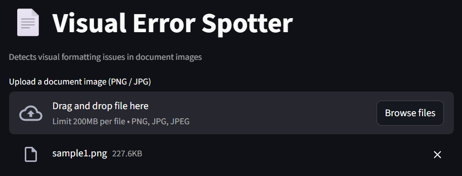
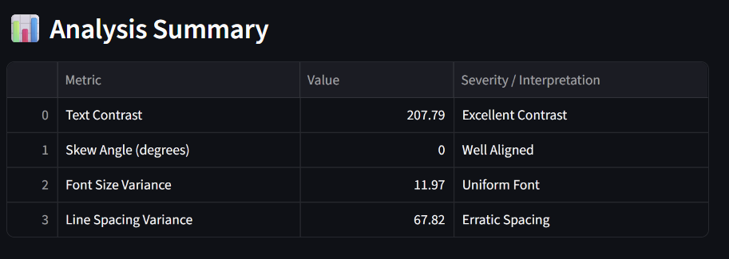

# 📄 Document Quality Assessment System

An intelligent document analysis tool that evaluates the **visual quality of scanned or digital documents** using Computer Vision and OCR-based techniques.


---

## 🚀 Problem & Motivation

💡 Designed for real-world OCR pipelines where input quality directly affects model accuracy.

Poor document quality is one of the biggest reasons OCR systems fail in real-world applications.

This project builds an automated document quality assessment system that analyzes key visual properties—such as contrast, alignment, typography, and spacing—to determine whether a document is suitable for reliable OCR processing.

The system combines multiple independent signals into a unified decision framework, enabling early detection of low-quality inputs before they impact downstream pipelines.


---

## 💡 Solution

This project provides an automated system to assess document quality using **multi-dimensional analysis**:

* 📐 Skew Detection (alignment issues)
* 🔤 Font Consistency Analysis (formatting irregularities)
* 🎨 Text Contrast Evaluation (readability)
* 📏 Line Spacing Analysis (layout structure)
* 📄 Document Type Detection (Printed vs Handwritten)

---

## 🧠 Key Features

✔ Multi-metric document evaluation
✔ OCR-based structural analysis
✔ Normalized statistical scoring (robust to layout variations)
✔ Context-aware warnings for handwritten documents
✔ Final decision system: **Accept / Review / Reject**
✔ Exportable analysis report (CSV)
✔ Interactive UI using Streamlit

---

## 🖥️ Demo Workflow

1. Upload a document image (JPG/PNG)
2. System detects document type
3. Performs quality analysis
4. Displays structured report
5. Provides final decision
6. Allows CSV download

---

## 📸 Screenshots

### 📤 Upload Interface



### 📊 Analysis Summary



### 📌 Final Decision Output


---


---

## 📊 Sample Output

| Metric        | Value  | Interpretation |
| ------------- | ------ | -------------- |
| Contrast      | 149.33 | Excellent      |
| Skew          | 0°     | Well Aligned   |
| Font Variance | 11.13  | Uniform        |
| Line Spacing  | 32.97  | Moderate       |

**Final Decision:** ✅ ACCEPTABLE

---
  
## ⚙️ Tech Stack

* Python
* OpenCV
* Tesseract OCR
* NumPy & Pandas
* Streamlit

---

## ▶️ How to Run

```bash
git clone https://github.com/mujammilibrahim007-art/Automated-Document-Quality-Assessment-System-for-OCR-Pipelines.git
pip install -r requirements.txt
streamlit run app.py
```

---

## ⚠️ Limitations

* Designed primarily for **printed documents**
* Handwritten text may produce unreliable metrics
* Heuristic thresholds (can be improved with labeled datasets)

---

## 🚀 Future Improvements

* ML-based document classification
* Confidence scoring system
* Layout-aware spacing detection
* API deployment for real-time processing

---

## 🧠 Key Insights

* Traditional document quality checks rely on raw metrics, which often fail on structured layouts (e.g., headings, bullet points).

* This system uses **normalized statistical measures (coefficient of variation)** to distinguish between natural layout variation and actual formatting issues.

* OCR-based region analysis enables extraction of structural features (font size, spacing, contrast) without relying on language understanding.

* Document type detection (Printed vs Handwritten) improves reliability by adapting interpretation logic based on OCR confidence.

* The system demonstrates how multiple weak signals (geometry, typography, clarity) can be combined into a **robust decision framework**.


⚠️ Note: This system is optimized for printed documents. Handwritten content may produce unreliable metrics.

---

## 👨‍💻 Author

Mujammil Ibrahim
